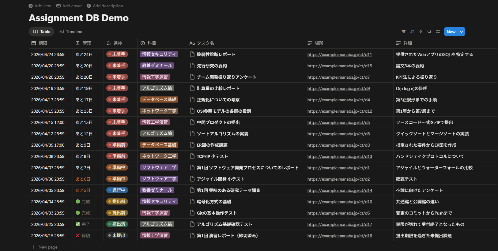

# manaba-notion-sync



**manaba（マナバ）システムを導入している大学**のポータルサイトを自動巡回して未提出の課題をスクレイピングし、Notion のデータベースへ自動で同期・登録する全自動スクリプトです。

このプロジェクトは、DockerとPlaywrightを用いて構築されており、**サーバー上で放置するだけで多要素認証（MFA）すらも自力で突破して課題情報を同期し続ける** ことを目的としています。

## 主な機能 🚀
- **完全な自動化 (MFA Bypass)**
  Microsoft Authenticator などのワンタイムパスワード（TOTP）のシークレットキーを環境変数に設定するだけで、ログイン時に要求される 6桁の認証コードを自己生成して自動入力します。「サインインの状態を維持しますか？」といった予測不能なステップも自力で突破します。
- **Notion とのシームレスな同期**
  Notion API を活用し、指定したデータベースに課題名、期限、コース名などのプロパティを格納します。さらに、そのまま1クリックで課題ページへ飛べるリッチテキストURLリンクも埋め込みます。
- **Dockerネイティブ・DevOps対応**
  Python環境やブラウザ（Chromium）のインストールはすべて `Dockerfile` 内で完結。ホストマシンの環境を汚さずに `docker compose up` だけで動かせます。
- **柔軟な時刻スケジュール機能**
  「60分おき」のような漫然とした定期実行ではなく、「08:00, 12:00, 17:00」のように任意のタイムテーブルを設定可能。サーバーへの負荷を最小限に抑えます。

---

## セットアップ手順 🛠️

### 1. 動作要件
- Docker および Docker Compose がインストールされた環境
- Notion API の Integrations トークンと、対象データベースのID

> [!TIP]
> **Notion データベースの準備**
> ゼロから必要なプロパティ（列）を作成するのは手間がかかるため、以下の**テンプレートデータベースを複製（Duplicate）して使用することを強く推奨**します！
> 
> 🔗 **[manaba-notion-sync 用 テンプレートデータベース](https://trail-plant-e9b.notion.site/98fd180df25083a0837081bcd8dc8c4e)**
> 
> （リンク先を開き、右上の「複製」アイコンからご自身のNotionワークスペースにコピーしてください。コピー後、右上の「･･･（設定）」→「コネクトの追加（Add connections）」から作成したボットを招待するのをお忘れなく！）

### 2. 環境変数の設定
プロジェクトのルートディレクトリに `.env` ファイルを作成し、以下の内容を記載してください。（セキュリティ設定として、このファイルはGitには追跡されません）

```env
NOTION_API_KEY=secret_xxxxxxxxxxxxxxxxxxxxxxxxxxx
NOTION_DATABASE_ID=xxxxxxxxxxxxxxxxxxxxxxxxxxxxxxxx
NOTION_DATASOURCE_ID=xxxxxxxxxxxxxxxxxxxxxxxxxxxxxxxx

# 大学指定の manaba のURL (例: https://xx.manaba.jp/ct)
MANABA_URL=https://your-university.manaba.jp/ct
MANABA_EMAIL=your-email@example.ac.jp
MANABA_PASSWORD=your_password_here

# （任意）完全自動化のためのMFAシークレットキー（Google Authenticator等に登録する際のテキストキー）
MANABA_MFA_SECRET=YOUR_MFA_SECRET_BASE32_HERE

# （任意）1日のうち実行したい時刻をカンマ区切りで指定（デフォルトは08:00,12:00,17:00,22:00）
SCRAPING_TIMETABLES=08:30,12:00,15:00,23:00

# （デモ用データ投入時のみ使用）
DEMO_NOTION_DATABASE_ID=xxxxxxxxxxxxxxxx
DEMO_NOTION_DATASOURCE_ID=xxxxxxxxxxxxxxxx
```

### 3. デプロイと起動
準備ができたら、以下のコマンドを叩くだけでコンテナがビルドされてバックグラウンドで起動します。

```bash
docker compose up -d --build
```

初回起動時に認証を突破し、`logs/` ディレクトリ内にセッション維持用の `cookies.json` が生成・保存されます。以降は設定されたタイムテーブルに従ってスケジュール実行され続けます！

---

## 開発・テスト用ツール 🧪
### デモデータの投入 (`generate_demo.py`)
セットアップした Notion データベースが正しく表示されるか確認するために、17件のダミー課題データを投入するスクリプトを用意しています。
1. `.env` に `DEMO_NOTION_DATABASE_ID` と `DEMO_NOTION_DATASOURCE_ID` を設定します。
2. 以下のコマンドを実行します。
```bash
python generate_demo.py
```

---

## トラブルシューティング
- **ログの確認**
  スクリプトが現在何をしているかを確認するには、以下のコマンドを実行します。
  ```bash
  docker compose logs -f
  ```
- **コンテナの停止**
  ```bash
  docker compose down
  ```

## 免責事項
当スクリプトは個人利用および学習を目的として作成されています。短時間での異常な連続アクセスによるサーバーへの過度な負荷を避けるため、スケジュールの設定は常識的な範囲（1日3〜4回程度）にとどめてご活用ください。
